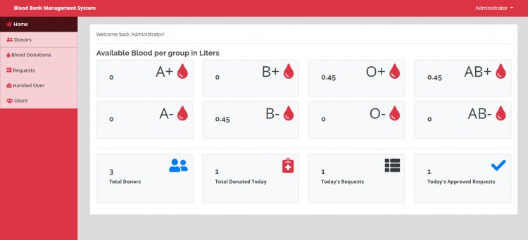

# Blood Bank Management System using PHP/MySQLi

  

### Description

The Blood Bank Management System is a simple PHP/MySQLi project that manages blood inventory in a certain blood bank. The system only allows the blood bank's management to access the data because the system focuses only on the data management or the inventory of the blood availability in a certain blood bank.

### Features

<ul>
  <li>Login Page</li>
  <li>Home Page</li>
  <li>Manage Donors</li>
  <li>Manage Blood Donations</li>
  <li>Manage Requests</li>
  <li>Manage Request Handover</li>
  <li>Manage Users</li>
</ul>

Visit [www.sourcecodester.com](https://www.sourcecodester.com/php/14547/blood-bank-management-system-using-phpmysqli-source-code.html) for more details and information about this project.

| Title | Blood Bank Management System using PHP/MySQLi with Source Code |
|:---|:---|
| Website | [www.sourcecodester.com](https://www.sourcecodester.com) |
| Link | https://www.sourcecodester.com/php/14547/blood-bank-management-system-using-phpmysqli-source-code.html |
| Language | PHP |
| Developer/Uploader | [oretnom23](https://www.sourcecodester.com/users/tips23) |
